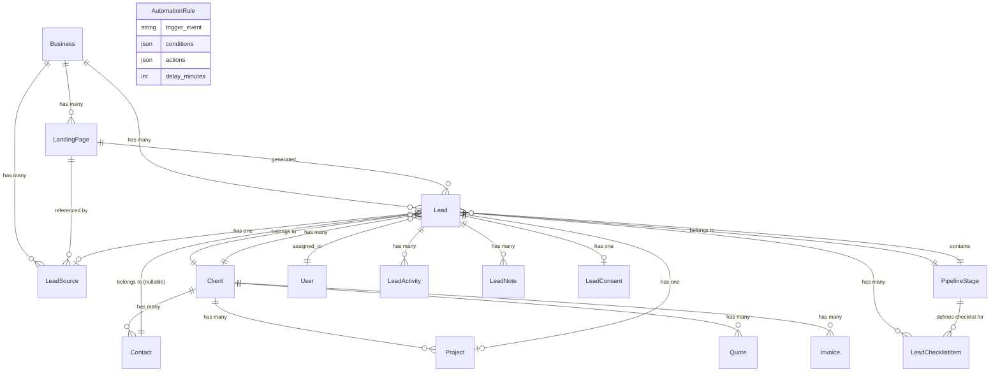

# CRM & Sales Pipeline — Analiza Integracji

> Raport wygenerowany w trakcie sesji 5 projektu Digital Growth OS  
> Cel: analiza istniejącego modułu CRM i pipeline sprzedażowego oraz zidentyfikowanie punktów integracji z Landing Pages / Lead Capture  
> **Nie zawiera kodu — wyłącznie analiza i rekomendacje**

---

## 1. Podsumowanie wykonawcze

Moduł CRM jest **dojrzały i kompletny** dla podstawowych operacji agencyjnych. Obsługuje pełen cykl od leada do projektu z aktywnością, notatkami i checklist per etap. Mechanizm **automatyzacji** (AutomationEventListener → ProcessAutomationJob) działa przez Eloquent events i jest rozszerzalny.

Integracja z **Landing Pages / Lead Capture** jest **częściowo zrealizowana** — pola `landing_page_id`, `utm_*`, `business_id` istnieją w tabeli `leads`, a nowy serwis `LeadService` + `LeadSource` + `LeadConsent` obsługuje atrybucję i GDPR. Jednak istnieje kilka krytycznych luk, które trzeba zamknąć przed produkcją.

**Stan integracji LP ↔ CRM:** ~65% gotowe.

---

## 2. Mapa modeli i relacji

### 2.1 Diagram relacji (Mermaid)



### 2.2 Model `Lead`

| Kolumna | Typ | Uwagi |
|---|---|---|
| id | bigint | PK |
| business_id | char(26) | nullable FK → businesses (ULID) |
| title | string | auto-generowany przez CreateLeadAction |
| client_id | FK | nullable → clients (nullOnDelete) |
| contact_id | FK | nullable → contacts; **nie wypełniany przez CreateLeadAction** |
| pipeline_stage_id | FK | → pipeline_stages (restrictOnDelete) |
| assigned_to | FK | nullable → users |
| value | decimal(12,2) | nullable |
| budget_min | decimal(12,2) | nullable |
| budget_max | decimal(12,2) | nullable |
| currency | char(3) | default GBP |
| source | enum | calculator / contact_form / referral / cold_outreach / social_media / other |
| calculator_data | json | dane kalkulatora |
| notes | text | nullable |
| expected_close_date | date | nullable |
| landing_page_id | FK | nullable → landing_pages (nullOnDelete) |
| utm_source | varchar(255) | nullable |
| utm_medium | varchar(255) | nullable |
| utm_campaign | varchar(255) | nullable |
| utm_content | varchar(255) | nullable |
| utm_term | varchar(255) | nullable |
| won_at | timestamp | nullable |
| lost_at | timestamp | nullable |
| lost_reason | string | nullable |
| timestamps + softDeletes | — | — |

### 2.3 Model `Client`

| Kolumna | Typ | Uwagi |
|---|---|---|
| company_name / trading_name | string | — |
| companies_house_number / vat_number | string | UK-specific |
| status | enum | prospect / active / inactive / archived |
| source | enum | website / referral / cold_outreach / social_media / google_ads / other |
| address_line1–2, city, county, postcode | string | UK address |
| country | char(2) | default GB |
| primary_contact_name/email/phone | string | **kluczowe: email jest kluczem unique** |
| assigned_to | FK | — |
| lifetime_value | decimal(12,2) | default 0 |
| currency | char(3) | default GBP |
| portal_user_id | FK | nullable → users |
| notify_email_transactional/projects/marketing | boolean | preferencje komunikacji |
| notify_sms | boolean | — |
| communication_prefs_updated_at | timestamp | nullable |
| softDeletes | — | cascade do contacts, leads, projects, quotes, invoices przez `forceDeleting` |

### 2.4 Model `Contact`

Uproszczony model dla osób kontaktowych w firmie:

| Kolumna | Typ |
|---|---|
| client_id | FK → clients (cascadeOnDelete) |
| first_name / last_name | string |
| email / phone / mobile | string (nullable) |
| position | string (nullable) |
| is_primary | boolean |
| notes | text (nullable) |
| softDeletes | — |

> **Uwaga**: Brak `ContactResource` w Filament — kontakty zarządzane wyłącznie jako RelationManager w `ClientResource`. To oznacza brak dedykowanego widoku listy kontaktów.

### 2.5 Model `PipelineStage`

| Kolumna | Typ | Uwagi |
|---|---|---|
| name / slug | string | slug unique |
| color | char(7) | hex |
| description | text | nullable |
| checklist | json | tablica warunków `{condition: string, label: string}` |
| order | integer | do sortowania |
| is_won | boolean | etap wygranej |
| is_lost | boolean | etap przegranej |

**Domyślne etapy pipeline (z AdminSeeder):**

| Order | Nazwa | Kolor | Flagi |
|---|---|---|---|
| 1 | New Lead | #6B7280 (gray) | — |
| 2 | Contacted | #3B82F6 (blue) | — |
| 3 | Proposal Sent | #8B5CF6 (purple) | — |
| 4 | Negotiation | #F59E0B (amber) | — |
| 5 | Won | #10B981 (green) | is_won=true |
| 6 | Lost | #EF4444 (red) | is_lost=true |

**Warunki checklist (PipelineStageResource):**  
`has_assignee`, `has_value`, `has_client`, `has_contact`, `has_expected_close`, `has_phone`, `has_email`, `email_sent`, `has_project`, `has_notes`, `has_calculator_data`

### 2.6 Model `LeadSource` (atrybucja)

Tabela `lead_sources` — tylko `created_at` (brak `updated_at`):

| Kolumna | Typ | Uwagi |
|---|---|---|
| lead_id | FK | — |
| business_id | FK | nullable |
| type | string | **landing_page** / contact_form / calculator / api / manual / import / referral |
| landing_page_id | FK | nullable |
| utm_source/medium/campaign/content/term | string | nullable |
| referrer_url / page_url | string | nullable |
| ip_address | string | raw IP (!) |
| ip_hash | string | hashed IP dla GDPR |
| user_agent / device_type | string | nullable |
| country_code | char(2) | nullable |

> **Ryzyko bezpieczeństwa:** Pole `ip_address` przechowuje surowy IP — może naruszać GDPR w zależności od jurysdykcji. Powinno być hashowane lub maskowane. [Medium Priority]

### 2.7 Model `LeadConsent` (GDPR)

| Kolumna | Typ |
|---|---|
| lead_id | FK |
| given | boolean |
| consent_text | text |
| consent_version | string |
| collected_at | datetime |
| source_url | string |
| ip_hash | string |
| locale | string |

Accessor `getAuditSummaryAttribute()` — gotowy audit log.

### 2.8 Model `LeadChecklistItem`

Śledzi wykonanie elementów checklist dla konkretnego etapu:

| Kolumna | Typ |
|---|---|
| lead_id | FK |
| pipeline_stage_id | FK |
| item_index | integer |
| completed_by | FK → users |
| completed_at | datetime |

> **Uwaga**: Model `Lead` **nie ma zdefiniowanej relacji** `checklistItems()` — dostęp tylko przez bezpośrednie zapytania w `ViewLead` page.

### 2.9 Model `AutomationRule`

| Kolumna | Typ |
|---|---|
| name | string |
| trigger_event | string |
| conditions | json |
| actions | json |
| delay_minutes | integer (default 0) |
| is_active | boolean |

---

## 3. Źródła leadów — dwal system

### Problem: Dualność `lead.source` vs `lead_sources.type`

Projekt posiada **dwa równoległe mechanizmy** klasyfikacji źródła leada:

| Mechanizm | Lokalizacja | Wartości |
|---|---|---|
| `leads.source` (legacy) | kolumna na Lead | calculator / contact_form / referral / cold_outreach / social_media / **other** |
| `lead_sources.type` (nowy) | model LeadSource | **landing_page** / contact_form / calculator / api / manual / import / referral |

**Kluczowa luka**: enum w `leads.source` nie zawiera wartości `landing_page`. Lead z LP dostanie `source='contact_form'` lub `source='other'`, podczas gdy `lead_sources.type='landing_page'` będzie poprawne. To rozbieżność widoczna w `LeadResource` (tabela i filtry używają obu pól).

**LeadsBySourceWidget** używa `leads.source` — wykresy pokazują nieprawidłowe dane dla leadów z LP.

---

## 4. Flow od utworzenia leada do zamknięcia sprzedaży

### 4.1 Aktualny flow (zrekonstruowany)

```
[Źródło]                    [Akcja]                              [Wynik]
────────────────────────────────────────────────────────────────────────────
LP Form / Calculator   ──► LeadService::createFromSource()  ──► Lead (DB)
Contact Form           ──► CreateLeadAction::execute()      ──► Client (firstOrCreate)
                                                             ──► LeadActivity 'created'
                                                             ──► NewLeadMail (queued → admin)
                                                             ──► LeadSource::record()
                                                             ──► LeadConsent::record()
                                                             ──► AutomationEventListener → ProcessAutomationJob
                                                                   └── AutomationRule evaluation
                                                                   └── send_email / send_sms / notify_admin / ...

[Filament CRM]
Admin przegląda lead ──► ViewLead page (checklist per stage)
Admin zmienia stage  ──► LeadService::updateStage()
                        ──► LeadActivity 'stage_moved'
                        ──► AutomationEventListener (lead.stage_changed)

Admin przypisuje     ──► LeadService::assign()
                        ──► LeadActivity 'assigned'
                        ──► LeadAssigned event (bez listenera!)

Admin konwertuje     ──► Project::create(['lead_id' => $lead->id])
  lead na projekt    ──► LeadActivity 'project_created'
                        ──► AutomationEventListener (project.created)

Lead.won_at set      ──► LeadService::markWon()
                        ──► LeadActivity 'marked_won'
                        ──► stage manual → Won (brak auto-move!)

Lead.lost_at+reason  ──► LeadService::markLost()
                        ──► LeadActivity 'marked_lost'
```

### 4.2 Brakujące ogniwa w flow

| Luka | Priorytet | Opis |
|---|---|---|
| `markWon()` nie przesuwa stage na `is_won=true` | HIGH | Lead zostaje na aktualnym etapie; trzeba ręcznie zmienić stage |
| `markLost()` nie przesuwa stage na `is_lost=true` | HIGH | j.w. |
| `LeadAssigned` event nie ma listenera | MEDIUM | Event jest generowany ale nikt go nie obsługuje (brak notyfikacji dla przypisanego usera) |
| Brak konwersji lead → Client jako aktywny klient | MEDIUM | Po wygraniu leada `client.status` pozostaje `prospect` |
| Brak automatycznego linku Quote/Invoice do leada | LOW | Quote i Invoice mają `client_id` ale nie `lead_id` |

---

## 5. Automatyzacje i eventy

### 5.1 AutomationEventListener — obsługiwane eventy

| Event Eloquent | Trigger generowany | Kontekst |
|---|---|---|
| Lead.created | `lead.created` | lead_id, client_id, source |
| Lead.updated (pipeline_stage_id) | `lead.stage_changed` | lead_id, client_id, stage_id, old_stage_id |
| Project.created | `project.created` | project_id, client_id, status |
| Project.updated (status) | `project.status_changed` | stary/nowy status |
| Invoice.updated (status=sent) | `invoice.sent` | invoice_id, client_id |
| Invoice.updated (status=paid) | `invoice.paid` | invoice_id, client_id |
| Quote.updated (status=sent) | `quote.sent` | quote_id, client_id |
| Quote.updated (status=accepted) | `quote.accepted` | quote_id, client_id |
| Contract.created | `contract.created` | contract_id, client_id |
| Contract.updated (status=sent/signed/expired) | `contract.sent/signed/expired` | — |

> **Uwaga**: `LeadCaptured` event (LP-specific) jest zdefiniowany w `app/Events/` ale **nie jest obsługiwany** przez `AutomationEventListener`. Oznacza to, że LP-specific logika nie może być wyzwalana przez reguły automatyzacji.

### 5.2 ProcessAutomationJob — dostępne akcje

| Klucz | Klasa Akcji |
|---|---|
| send_email | SendEmailAction |
| send_internal_email | SendInternalEmailAction |
| send_sms | SendSmsAction |
| notify_admin | NotifyAdminAction |
| add_tag | AddTagAction |
| change_status | ChangeStatusAction |
| create_portal_access | CreatePortalAccessAction |

### 5.3 Brakujące triggery automatyzacji

| Brakujący trigger | Zastosowanie |
|---|---|
| `lead.assigned` | Powiadom przypisanego użytkownika |
| `lead.won` | Celebracja, aktualizacja klienta na 'active', trigger onboarding |
| `lead.lost` | Feedback loop, follow-up za X dni |
| `lead.captured_from_lp` | LP-specific welcome email, lead scoring |
| `lead.stale` (scheduled) | Reminder po 7 dniach bez aktywności |

---

## 6. Notyfikacje

### 6.1 Stan aktualny

Katalog `app/Notifications/` **nie istnieje**. System powiadomień oparty wyłącznie na:
- `NewLeadMail` — email do admina przy nowym leadzie (queued Mailable)
- `ProcessAutomationJob` → `NotifyAdminAction` — powiadomienie admin przez automatyzacje
- `DatabaseNotification` (model) — tabela `notifications` istnieje (Eloquent model), ale **nie ma żadnych klas Notification**

### 6.2 Brakujące notyfikacje

| Notyfikacja | Do kogo | Kanał |
|---|---|---|
| Nowy lead przypisany | Przypisany użytkownik | database + email |
| Lead stale (7 dni) | Menedżer | database |
| Lead wygrany | Team | database |
| Nowy lead z LP | Admin | database + email (osobny template per business) |

---

## 7. Integracja z Filament

### 7.1 Istniejące zasoby CRM

| Resource | Grupa | Sort | Uwagi |
|---|---|---|---|
| ClientResource | CRM | 1 | pełny infolist, portal user status, communication prefs |
| LeadResource | CRM | 2 | source badge, leadSource.type, landingPage.title (toggleable) |
| PipelineStageResource | CRM | 4 | reorderable, cascade safety na delete |

### 7.2 Widgety dashboardu

| Widget | Sort | Dane |
|---|---|---|
| StatsOverviewWidget | 1 | Active Projects, New Leads This Month, Overdue Invoices, Revenue This Month |
| RecentLeadsWidget | 2 | 8 ostatnich leadów (bez filtrowania po business_id!) |
| RevenueChartWidget | 6 | bar chart 12 miesięcy |
| LeadsBySourceWidget | 7 | doughnut chart — używa `leads.source` (legacy) |
| StaleLeadsWidget | 6 | leads > 7 dni bez aktywności (bez filtrowania po business_id!) |

### 7.3 Filament — brakujące elementy

| Element | Priorytet | Opis |
|---|---|---|
| ContactResource | MEDIUM | brak dedykowanego Filament resource dla Contact |
| ClientPolicy | HIGH | brak Policy, dostęp tylko przez Spatie permissions |
| Filtrowanie widgetów po business_id | HIGH | multi-tenant: widgety pokazują dane wszystkich biznesów |
| Lead → Project akcja w ViewLead | MEDIUM | konwersja lead na projekt inline |
| budget_min/budget_max w LeadResource form | LOW | pola istnieją w DB/modelu ale nie ma ich w formularzu |

---

## 8. Uprawnienia Spatie i role

### 8.1 CRM-specific permissions

| Uprawnienie | admin | manager | developer | client |
|---|---|---|---|---|
| view_leads | ✅ | ✅ | ✅ | ❌ |
| create_leads | ✅ | ✅ | ❌ | ❌ |
| edit_leads (manage_leads) | ✅ | ✅ | ❌ | ❌ |
| delete_leads | ✅ | ✅ | ❌ | ❌ |
| export_leads | ✅ | ❌ | ❌ | ❌ |
| manage_leads | ✅ | ✅ | ❌ | ❌ |
| view_lead_sources | ✅ | ✅ | ✅ | ❌ |
| manage_api_tokens | ✅ | ✅ | ❌ | ❌ |
| view_clients | ✅ | ✅ | ✅ | ❌ |
| create/edit/delete_clients | ✅ | ✅ | ❌ | ❌ |
| view_landing_pages | ✅ | ✅ | ✅ | ❌ |
| manage_landing_pages | ✅ | ✅ | ❌ | ❌ |
| publish_landing_pages | ✅ | ✅ | ❌ | ❌ |
| manage_pipeline | ✅ | ❌ | ❌ | ❌ |
| view_automations | ✅ | ✅ | ❌ | ❌ |
| manage_automations | ✅ | ✅ | ❌ | ❌ |

### 8.2 LeadPolicy — logika dostępu

```
viewAny: can('view_leads') || hasAnyRole(['admin','manager','developer'])
view:    = viewAny()
create:  can('manage_leads') || hasAnyRole(['admin','manager'])
update:  can('manage_leads') || hasAnyRole(['admin','manager'])
delete:  can('delete_leads') || hasRole('admin')
export:  can('export_leads') || hasRole('admin')
```

> **Uwaga**: Brak `ClientPolicy`. Dostęp do klientów sprawdzany tylko przez permissions w `ClientResource`, co daje mniejszą granularność.

---

## 9. Punkty integracji LP ↔ CRM (gdzie bezpiecznie podpiąć)

### 9.1 Zaimplementowane integracje (sesje 3–4)

| Punkt | Status | Mechanizm |
|---|---|---|
| LP lead tworzony przez `LeadService::createFromSource()` | ✅ GOT | wraps CreateLeadAction |
| `leads.landing_page_id` FK | ✅ GOT | migracja + model |
| `leads.utm_*` pola | ✅ GOT | 5 kolumn |
| `lead_sources` atrybucja | ✅ GOT | model + seeder |
| `lead_consents` GDPR | ✅ GOT | model |
| `LeadCaptured` event | ✅ GOT | emitowany po createFromSource |
| `LeadSource::TYPES` zawiera `landing_page` | ✅ GOT | stała w modelu |
| `LeadResource` pokazuje `leadSource.landingPage.title` | ✅ GOT | toggleable column |

### 9.2 Bezpieczne punkty rozbudowy

| Punkt | Gdzie | Co dodać |
|---|---|---|
| **AutomationEventListener** | klasa `/Listeners` | nasłuch na `LeadCaptured` event → trigger `lead.captured_from_lp` |
| **ProcessAutomationJob ACTION_MAP** | klasa `/Jobs` | nowa akcja `send_lp_welcome_email` |
| **LeadResource filters** | Filament | filtr po `landing_page_id` (page-specific inbox) |
| **RecentLeadsWidget** | Filament widget | scoped po `business_id` current user |
| **LeadsBySourceWidget** | Filament widget | przełącz na `lead_sources.type` zamiast `leads.source` |
| **PipelineStage checklist** | `pipeline_stages.checklist` | warunek `has_consent` dla leadów z LP |
| **CreateLeadAction** | Actions | dodać opcjonalne tworzenie Contact przy `contact_id = null` |

---

## 10. Brakujące pola dla leadów z Landing Pages

Poniższe dane często zbierane z LP nie mają dedykowanego miejsca:

| Brakujące dane | Obecny workaround | Rekomendacja |
|---|---|---|
| Dedykowany temat/projekt z formularza LP | Wchodzi w `notes` lub `title` | Dodać `subject` / `project_interest` jako column |
| Budżet (range) z suwaka LP | `budget_min` + `budget_max` istnieją, ale LP form tych pól nie używa | Wypełniać z formularza LP |
| Język / locale lead'a | Brak kolumny na Lead | `lead_sources.country_code` + `lead_consents.locale` (pośrednio) |
| Scoring lead'a (gorący/zimny) | Brak | Dodać `score` int nullable na Lead lub w LeadSource |
| Status GDPR wprost na Lead | Brak kolumny | `lead.consent()->exists()` — OK przez relację |
| Odpowiedzi z formularza LP (custom fields) | `calculator_data` json (wyłącznie kalkulator) | Dodać `form_data` json nullable na Lead |
| Preferred contact method | Brak | Dodać enum (`email`/`phone`/`whatsapp`) |

---

## 11. Ryzyka duplikatów danych

### 11.1 `CreateLeadAction::firstOrCreate` na emailu

```php
$client = Client::firstOrCreate(
    ['primary_contact_email' => $data['email']],
    [ /* company data */ ]
);
```

**Ryzyka:**
1. Ten sam email = ten sam klient, nawet jeśli różne firmy / landing pages / businessy. Jeśli Jan Kowalski zmienił pracę i wypełnił 2 formularze z różnych firm, oba leady będą pod starą firmą.
2. Brak weryfikacji `business_id` przy `firstOrCreate` — w modelu multi-tenant klient z firmy A (business_id=1) może zostać powiązany z leadem firmy B (business_id=2).
3. Brak transakcji — gdyby `Lead::create()` się nie powiodło po `Client::firstOrCreate()`, klient zostanie w bazie bez leada.

### 11.2 Dualność `leads.source` vs `lead_sources.type`

- `leads.source` enum jest ustawiany przez `CreateLeadAction` na podstawie `$data['source']` np. `contact_form`
- `lead_sources.type` jest ustawiany przez `LeadSourceService::record()` na podstawie `$sourceData['type']` np. `landing_page`
- Te dwie wartości mogą być **niespójne** dla tego samego leada
- `LeadsBySourceWidget` używa `leads.source` — raport źródeł jest błędny dla LP leadów

### 11.3 Brak unikalności contact_email per business

Tabela `clients` nie ma unique constraint na `(primary_contact_email, business_id)` — tylko na `primary_contact_email`. W środowisku multi-tenant klient z email X w business A zablokuje tworzenie klienta z tym samym emailem w business B.

---

## 12. Ryzyka wymagające refaktoryzacji przed integracją

### 12.1 [HIGH] Multi-tenant isolation w LeadResource

```php
// LeadResource::getEloquentQuery()
return Lead::withTrashed(); // ← pokazuje leady WSZYSTKICH biznesów
```

Brak filtrowania po `business_id` aktualnie zalogowanego użytkownika. Każdy admin Filament widzi leady wszystkich tenantów. **Do naprawy przed wdrożeniem multi-tenant.**

### 12.2 [HIGH] Client firstOrCreate bez business scope

`CreateLeadAction` przy tworzeniu klienta nie uwzględnia `business_id`. W SaaS każdy tenant (business) powinien mieć własne izolowane klientów. Trzeba albo:
- Dodać `business_id` do `clients` tabeli i `firstOrCreate` warunku
- Lub wyraźnie zdokumentować że `clients` to globalna pula (nie zalecane dla SaaS)

### 12.3 [HIGH] Brak ClientPolicy

`clients` tabela nie ma Policy — dostęp oparty wyłącznie o Spatie permissions (granularność rola-level, nie rekord-level). Uniemożliwia row-level security (np. manager może widzieć tylko klientów przypisanych do niego).

### 12.4 [HIGH] `leadsource.ip_address` raw IP

Przechowywanie surowego IP bez pseudonimizacji może naruszać GDPR. Pole `ip_hash` istnieje — `ip_address` powinno zostać usunięte lub zamienione na maskowaną wersję (np. `192.168.1.*`).

### 12.5 [MEDIUM] `contact_id` null dla leadów z LP

`CreateLeadAction` tworzy `Client` ale nie tworzy `Contact`. Wynikiem jest `lead.contact_id = null` dla wszystkich leadów z LP/contact_form. Checklist warunek `has_contact` zawsze będzie niespełniony. Trzeba albo:
- Rozszerzyć `CreateLeadAction` o opcjonalne tworzenie Contact z first_name/last_name/email/phone
- Lub usunąć `has_contact` z domyślnego checklist

### 12.6 [MEDIUM] `LeadAssigned` event bez listenera

`LeadService::assign()` emituje event `LeadAssigned` ale żaden listener nie istnieje — brak powiadomienia dla przypisanego użytkownika. Oznacza to, że developer lub manager nie wie, że ma nowego leada.

### 12.7 [MEDIUM] `LeadChecklistItem` bez relacji w modelu Lead

```php
// Lead.php — BRAK:
public function checklistItems(): HasMany { ... }
```

Dostęp przez bezpośrednie zapytanie w `ViewLead.php`. Tworzy tight coupling i utrudnia przekazanie danych przez Inertia/API.

### 12.8 [MEDIUM] `markWon()` i `markLost()` bez auto-stage

After `LeadService::markWon()`, lead nie jest przenoszony na etap z `is_won=true`. Admin musi manualnie zmienić stage. To prowadzi do niespójności — lead jest "wygrany" ale wygląda jakby był w "Negotiation". Analogicznie dla markLost.

### 12.9 [LOW] `budget_min` / `budget_max` bez formularza

Pola istnieją w DB i modelu Lead, ale nie ma ich w formularzu `LeadResource`. Brak możliwości ustawiania przez admina w Filament.

### 12.10 [LOW] `LeadsBySourceWidget` używa legacy source field

Widżet pieChart używa `leads.source` (enum). Po wdrożeniu LP należy go przełączyć na `lead_sources.type` z JOIN, inaczej leady z LP będą pokazane jako `contact_form` lub `other`.

---

## 13. Checklist gotowości do integracji LP ↔ CRM

| Zadanie | Status | Priorytet |
|---|---|---|
| Dodać `business_id` scope do `CreateLeadAction` i `Client::firstOrCreate` | ❌ | HIGH |
| Dodać `ClientPolicy` z row-level security | ❌ | HIGH |
| Dodać `business_id` filtr w `LeadResource::getEloquentQuery()` | ❌ | HIGH |
| Usuń lub zamaskuj `ip_address` raw w `lead_sources` | ❌ | HIGH |
| Dodać listener dla `LeadCaptured` event w AutomationEventListener | ❌ | HIGH |
| Napraw `markWon()`/`markLost()` → auto-move stage | ❌ | MEDIUM |
| Dodaj `Contact` creation w `CreateLeadAction` (z LP data) | ❌ | MEDIUM |
| Dodaj listener / Notification dla `LeadAssigned` event | ❌ | MEDIUM |
| Dodaj relację `checklistItems()` do `Lead` model | ❌ | MEDIUM |
| Przełącz `LeadsBySourceWidget` na `lead_sources.type` | ❌ | MEDIUM |
| Dodaj `budget_min`/`budget_max` do `LeadResource` form | ❌ | LOW |
| Dodaj `form_data` json do leads table (custom LP fields) | ❌ | LOW |
| Dodaj `score` int do leads table (lead scoring) | ❌ | LOW |
| Dodaj `ContactResource` w Filament | ❌ | LOW |

---

## 14. Wnioski

Moduł CRM jest solidną podstawą — ma kompletne modele, pipeline, automatyzacje i tracking atrybucji. Fundamenty dla integracji LP zostały zbudowane (landng_page_id, utm_*, LeadSource, LeadConsent, LeadService).

Przed produkcyjnym wdrożeniem multi-tenant **krytyczne** jest:
1. Izolacja danych per `business_id` (Client firstOrCreate, LeadResource query, widgety)
2. Bezpieczeństwo danych osobowych (ip_address raw)
3. Pełny event → automation → notification pipeline dla leadów z LP

Bez (1) i (2) system jest funkcjonalny tylko dla modelu single-tenant (jedna agencja).
