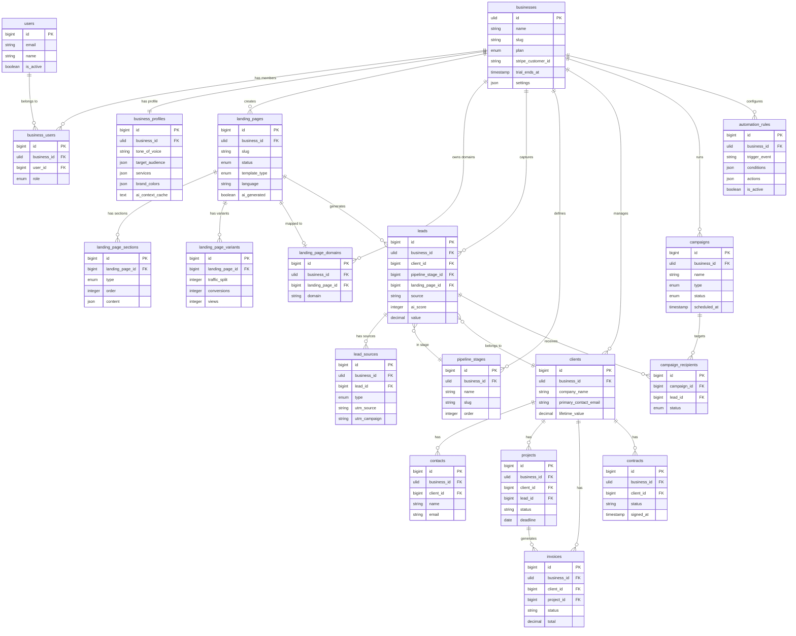

# Plan architektury SaaS — Digital Growth OS
> Data: 2026-04-03 (aktualizacja) | Bazuje na: `docs/project-analysis.md`
> **Status implementacji**: BusinessProfile ✅ | LandingPages ✅ | Leads ~80% | CRM ✅ | Billing ❌ | Automations ✅

---

## Wstęp

Digital Growth OS to platforma SaaS przeznaczona dla agencji i freelancerów. Transformowana z narzędzia single-tenant (WebsiteExpert Ltd) w system wielodzierżawczy, gdzie każda firma (tenant) zarządza swoimi landing pages, leadami i CRM we własnej, izolowanej przestrzeni danych.

**Stack bazowy (niezmieniony):**
- Laravel 13, PHP 8.3
- Filament 5.4 (panel admin)
- Inertia.js 2.0 + React 18 (frontend)
- Tailwind CSS 4.x
- Spatie Permission 7.2 + Translatable 6.13
- Stripe, PayU, Twilio (istniejące)

---

## 1. Bounded Contexts

### Mapa kontekstów

```
┌────────────────────────────────────────────────────────────────────┐
│                        Digital Growth OS                           │
│                                                                    │
│  ┌─────────────┐   upstream   ┌──────────────┐                   │
│  │  Identity   │──────────────│ Subscriptions│                   │
│  │  & Access   │              │  & Billing   │                   │
│  └──────┬──────┘              └──────┬───────┘                   │
│         │ shared kernel               │                           │
│         ▼                             ▼                           │
│  ┌─────────────────────────────────────────────────────┐          │
│  │              BusinessProfile (Tenant Root)           │          │
│  └──┬─────────────────┬──────────────────┬─────────────┘          │
│     │                 │                  │                        │
│     ▼                 ▼                  ▼                        │
│  ┌──────────┐  ┌─────────────┐  ┌──────────────┐                │
│  │ Landing  │  │    Leads    │  │    CRM       │                │
│  │  Pages   │─▶│  Capture   │─▶│ (istniejący) │                │
│  └──────────┘  └──────┬──────┘  └──────┬───────┘                │
│                        │                │                        │
│                        └────────────────┘                        │
│                                 │                                 │
│                    ┌────────────┴──────────┐                     │
│                    ▼                       ▼                      │
│             ┌─────────────┐     ┌──────────────────┐             │
│             │  Campaigns  │     │   Automations    │             │
│             │  (email/SMS)│     │  (istniejące)    │             │
│             └─────────────┘     └──────────────────┘             │
└────────────────────────────────────────────────────────────────────┘
```

---

### 1.1 Kontekst: Identity & Access (Shared Kernel)

| Element | Opis |
|---------|------|
| **Nazwa** | `IdentityAccess` |
| **Odpowiedzialność** | Rejestracja użytkowników, logowanie, role, uprawnienia, relacja user↔business |
| **Główne encje** | `User`, `Business`, `BusinessUser` (pivot z rolą), `Role`, `Permission` |
| **Granice** | Nie zarządza danymi biznesowymi (leadami, stronami, fakturami) |
| **Interfejsy** | Emituje: `UserRegistered`, `BusinessCreated`; udostępnia: `auth()->user()`, `currentBusiness()` |

**Istniejące modele do zachowania:** `User` (z `HasRoles`)  
**Nowe modele:** `Business` (tenant root), `BusinessUser` (membership)

---

### 1.2 Kontekst: Subscriptions & Billing

| Element | Opis |
|---------|------|
| **Nazwa** | `Subscriptions` |
| **Odpowiedzialność** | Plany SaaS, limity funkcji, billing przez Stripe Cashier, trial periods |
| **Główne encje** | `Business` (rozszerzony o `stripe_customer_id`), `Subscription`, `Plan` |
| **Granice** | Nie zarządza fakturami dla klientów agencji (to `Finance` context) — to są subskrypcje SaaS |
| **Interfejsy** | Emituje: `SubscriptionCreated`, `SubscriptionCancelled`; nasłuchuje: `BusinessCreated` |

**Uwaga:** Istniejący `StripeWebhookController` obsługuje płatności od klientów agencji. Nowy context `Subscriptions` obsłuży płatności od agencji/freelancerów za korzystanie z SaaS — **dwa różne flow**.

---

### 1.3 Kontekst: BusinessProfile (Tenant Root)

| Element | Opis |
|---------|------|
| **Nazwa** | `BusinessProfile` |
| **Odpowiedzialność** | Dane firmy: brand (logo, kolory, fonty), tone of voice, target audience, dane kontaktowe — kontekst dla AI |
| **Główne encje** | `Business`, `BusinessProfile` (1:1 z Business) |
| **Granice** | Nie zarządza subskrypcją (to `Subscriptions`); nie zarządza treścią stron (to `LandingPages`) |
| **Interfejsy** | Udostępnia: `BusinessProfileService::getAiContext(Business $b)` → dane dla OpenAI prompt; emituje: `BusinessProfileUpdated` |

**AI Context** (dane przekazywane do OpenAI):
```
brand_name, tagline, primary_color, tone_of_voice,
target_audience, services[], industry, language
```

---

### 1.4 Kontekst: LandingPages

| Element | Opis |
|---------|------|
| **Nazwa** | `LandingPages` |
| **Odpowiedzialność** | Generowanie (AI), edycja, publikacja, hosting, A/B testing, custom domains, analityka konwersji |
| **Główne encje** | `LandingPage`, `LandingPageSection` (bloki), `LandingPageVariant`, `LandingPageDomain` |
| **Granice** | Nie przechowuje leadów (to `Leads` context); nie zarządza domeną główną firmy |
| **Interfejsy** | Emituje: `LandingPagePublished`, `LeadCaptured` (→ Leads); nasłuchuje: `BusinessProfileUpdated` (odświeżenie kontekstu AI) |

**Core feature SaaS** — brak implementacji. Wymaga OpenAI.

---

### 1.5 Kontekst: Leads (rozszerzony istniejący)

| Element | Opis |
|---------|------|
| **Nazwa** | `Leads` |
| **Odpowiedzialność** | Przechwytywanie leadów (formularz, kalkulator, landing page), scoring, deduplicacja, przekazywanie do CRM |
| **Główne encje** | `Lead` (istniejący), `LeadSource`, `LeadNote` (istniejący), `LeadActivity` (istniejący) |
| **Granice** | Nie zarządza kontaktami długoterminowymi (to CRM); nie wysyła kampanii (to `Campaigns`) |
| **Interfejsy** | Emituje: `LeadCreated`, `LeadStageChanged`; nasłuchuje: `LandingPageSubmitted` (→ tworzenie leada); udostępnia: `CreateLeadAction` (istniejący) |

**Stan obecny:** Zaimplementowany jako `Lead` model + Filament Resource + Pipeline Kanban.  
**Do zrobienia:** Dodać `business_id`, `LeadSource` z UTM tracking, scoring AI.

---

### 1.6 Kontekst: CRM (istniejący, rozszerzony)

| Element | Opis |
|---------|------|
| **Nazwa** | `CRM` |
| **Odpowiedzialność** | Zarządzanie relacjami: klienci, kontakty, projekty, finanse (faktury, oferty, umowy), portal klienta |
| **Główne encje** | `Client`, `Contact`, `Project`, `Invoice`, `Quote`, `Contract`, `PipelineStage` |
| **Granice** | Nie generuje landing pages; nie prowadzi kampanii masowych (to `Campaigns`) |
| **Interfejsy** | Nasłuchuje: `LeadCreated` (auto-tworzenie Client); emituje: `ProjectStatusChanged`, `InvoicePaid` |

**Stan obecny:** Najbardziej rozbudowany kontekst — 20+ modeli, 26 Filament Resources, portal klienta.  
**Do zrobienia:** Dodać `business_id` do wszystkich tabel.

---

### 1.7 Kontekst: Campaigns

| Element | Opis |
|---------|------|
| **Nazwa** | `Campaigns` |
| **Odpowiedzialność** | Kampanie email/SMS do leadów i klientów, segmentacja, harmonogram, statystyki otwarć/kliknięć |
| **Główne encje** | `Campaign`, `CampaignMessage`, `CampaignRecipient`, `CampaignStat` |
| **Granice** | Nie zarządza transakcyjnymi emailami (to `CRM` → automations); tylko masowe kampanie marketingowe |
| **Interfejsy** | Korzysta z: `SmsService` (istniejący), Laravel Mail; nasłuchuje: `LeadCreated` (dodanie do listy), emituje: `CampaignMessageSent` |

**Stan obecny:** Brak implementacji (moduł nowy).

---

### 1.8 Kontekst: Automations (istniejący, rozszerzony)

| Element | Opis |
|---------|------|
| **Nazwa** | `Automations` |
| **Odpowiedzialność** | Reguły trigger→condition→action, silnik kolejkowy, 7 typów akcji |
| **Główne encje** | `AutomationRule` (istniejący) |
| **Granice** | Nie przechowuje danych biznesowych — tylko konfigurację reguł |
| **Interfejsy** | Nasłuchuje: wszystkie Eloquent events (Lead, Project, Invoice, Quote, Contract); wykonuje: `ProcessAutomationJob` |

**Stan obecny:** W pełni zaimplementowany. Wymaga tylko `business_id` i izolacji reguł per tenant.

---

### 1.9 Relacje między kontekstami

```
Identity (upstream) ──────────────────▶ Wszystkie konteksty (downstream)
                                         (każdy context wymaga auth + business_id)

BusinessProfile ──── "AI context" ─────▶ LandingPages (GenerateContentService)
BusinessProfile ──── "brand data" ─────▶ Campaigns (template styling)

LandingPages ──── "LeadCaptured event" ▶ Leads (CreateLeadAction)
Leads        ──── "LeadCreated event"  ▶ CRM (auto-client creation)
Leads        ──── "LeadCreated event"  ▶ Automations (trigger)
CRM          ──── "client data"        ▶ Campaigns (recipients)
CRM          ──── "events"             ▶ Automations (triggers)

Subscriptions ─── "plan limits" ───────▶ LandingPages (max pages/variant limit)
Subscriptions ─── "plan limits" ───────▶ Campaigns (max recipients limit)
```

**Wzorzec komunikacji:** Laravel Events + Listeners (istniejący mechanizm) — nie potrzeba message brokera w MVP.

---

## 2. Strategia Multi-Tenancy

### 2.1 Wybór strategii: **Single DB + `business_id` (+ opcjonalne Row-Level Security)**

**Rekomendacja: Single Database z globalnym scope `business_id` na modelach.**

Uzasadnienie dopasowane do projektu:

| Kryterium | Single DB + `business_id` | Multi-DB |
|-----------|--------------------------|----------|
| Prędkość implementacji | ✅ Szybka — jeden trait na modelach | ❌ Wolna — migracje per tenant |
| Izolacja danych | ⚠️ Logiczna (global scope) | ✅ Pełna fizyczna |
| Operacje cross-tenant (admin) | ✅ Proste — usunąć scope | ❌ Wymaga connection switching |
| Skalowanie do 100 tenantów | ✅ OK z indeksami | ✅ Lepsze |
| Skalowanie do 10 000 tenantów | ⚠️ Wymaga shardowania | ✅ Naturalne |
| Zgodność z istniejącym kodem | ✅ Minimalne zmiany w Eloquent | ❌ Pełny rewrite |
| Laravel Cashier (Stripe) | ✅ Jeden model Billing | ⚠️ Trudniejsze |

**Decyzja:** Digital Growth OS startuje jako produkt dla agencji (<500 tenantów w MVP). Single DB z indeksami na `business_id` jest optymalnym wyborem. Multi-DB można rozważyć przy skalowaniu enterprise (v3+).

---

### 2.2 Implementacja izolacji

#### Trait `BelongsToTenant`

```php
// Pseudokod — bez implementacji
trait BelongsToTenant
{
    boot() → static::addGlobalScope(new BusinessScope)
            → static::creating() → $model->business_id = currentBusiness()->id
    
    scopeWithoutTenant() → Model::withoutGlobalScope(BusinessScope)  // dla super-admin
}
```

Modele do objęcia trait'em (priorytet wdrożenia):
1. `Lead`, `Client`, `Contact` — HIGH (core CRM)
2. `Project`, `Invoice`, `Quote`, `Contract` — HIGH (Finance)
3. `AutomationRule`, `EmailTemplate`, `SmsTemplate` — MEDIUM
4. `Page`, `SiteSection`, `Setting` — MEDIUM
5. `LandingPage`, `Campaign` (nowe) — przy tworzeniu modułu

#### `BusinessScope` — GlobalScope

```php
// Pseudokod
class BusinessScope implements Scope
{
    apply() → $builder->where('business_id', currentBusiness()?->id)
}
```

#### Middleware identyfikacji tenanta

**Strategia identyfikacji: subdomena + fallback headerem**

```
{slug}.app.digitalgrowth.os → Business::where('slug', $subdomain)
X-Business-Id: uuid          → Business::find($uuid) [dla API]
```

Priorytet:
1. **Subdomena** — dla UI (agencja.digitalgrowth.os)
2. **Header `X-Business-Id`** — dla API (zewnętrzne integracje)
3. **Session `business_id`** — fallback po logowaniu

```php
// Pseudokod middleware
class IdentifyBusiness
{
    handle() → 
        $subdomain = extractSubdomain(request()->host())
        $business = Business::where('slug', $subdomain)->firstOrFail()
        app()->instance(Business::class, $business)
        config(['current_business_id' => $business->id])
}
```

#### Filament — izolacja danych w panelu

**Rozwiązanie: jeden globalny panel `/admin` z per-tenant filtering.**

Filament Resources automatycznie korzystają z GlobalScope — każdy zapytanie Eloquent w Resource jest już odfiltrowane przez `business_id` na poziomie modelu.

Superadmin (Digital Growth OS team) będzie miał osobny panel `/superadmin` bez GlobalScope — do zarządzania wszystkimi tenantami.

```
/admin         → panel agencji (filtruje przez business_id)
/superadmin    → panel super-admin DG OS (bez filtrowania)
```

---

### 2.3 Tabela `businesses` (Tenant Root)

```
businesses
├── id             (ulid / uuid)           — primary key
├── name           (string)                — pełna nazwa firmy
├── slug           (string, unique)        — subdomena: "agencja-x"
├── plan           (enum: free|starter|pro|agency) — aktualny plan SaaS
├── stripe_customer_id (string, nullable)  — Stripe Customer dla Cashier
├── trial_ends_at  (timestamp, nullable)   — koniec okresu próbnego
├── settings       (json)                  — per-tenant settings (override)
├── locale         (string, default: 'en') — domyślny język UI
├── timezone       (string)               — strefa czasowa
├── logo_path      (string, nullable)     — logo firmy
├── primary_color  (string, nullable)     — główny kolor brand
├── is_active      (boolean, default: true)
├── created_at / updated_at
└── deleted_at     (SoftDeletes)
```

Tabela `business_users` (membership):
```
business_users
├── id
├── business_id    FK → businesses.id
├── user_id        FK → users.id
├── role           (enum: owner|admin|member)   — rola w ramach business (nie Spatie)
├── is_active      (boolean)
├── invited_by     FK → users.id, nullable
├── joined_at      (timestamp)
└── UNIQUE(business_id, user_id)
```

---

## 3. Model danych

### 3.1 Bounded Context: BusinessProfile

```
business_profiles
├── id
├── business_id        FK → businesses.id (unique — 1:1)
├── tagline            (string, nullable)        — hasło firmy
├── description        (text, nullable)          — opis firmy
├── industry           (string, nullable)        — branża
├── tone_of_voice      (enum: professional|friendly|bold|minimalist)
├── target_audience    (json)                    — {"age": "25-45", "gender": "mixed", ...}
├── services           (json)                    — lista usług firmy
├── brand_colors       (json)                    — {"primary": "#ff0", "secondary": "#000"}
├── fonts              (json)                    — {"heading": "Syne", "body": "Inter"}
├── website_url        (string, nullable)
├── social_links       (json)                    — {facebook, instagram, linkedin, ...}
├── seo_keywords       (json)                    — słowa kluczowe do meta
├── ai_context_cache   (text, nullable)          — cache skompilowanego prompta AI (TTL 24h)
├── created_at / updated_at
```

### 3.2 Bounded Context: LandingPages

```
landing_pages
├── id
├── business_id        FK → businesses.id       [INDEX]
├── title              (string)                  — roboczy tytuł
├── slug               (string)                  — URL: /lp/{slug}
├── status             (enum: draft|published|archived)
├── template_type      (enum: lead_capture|sales|webinar|coming_soon)
├── language           (enum: en|pl|pt)
├── meta_title         (string, nullable)
├── meta_description   (text, nullable)
├── conversion_goal    (string, nullable)        — np. "book_call", "download", "purchase"
├── ai_generated       (boolean, default: false) — czy wygenerowane przez AI
├── published_at       (timestamp, nullable)
├── created_at / updated_at / deleted_at
└── UNIQUE(business_id, slug)

landing_page_sections
├── id
├── landing_page_id    FK → landing_pages.id
├── type               (enum: hero|features|testimonials|cta|faq|form|pricing|video)
├── order              (integer)
├── content            (json)                    — treść sekcji (elastyczna struktura)
├── settings           (json)                    — kolory, wariant, widoczność
├── created_at / updated_at

landing_page_variants         (A/B testing)
├── id
├── landing_page_id    FK → landing_pages.id
├── name               (string)                  — "Wariant A", "Wariant B"
├── traffic_split      (integer, default: 50)    — % ruchu
├── is_winner          (boolean, nullable)
├── conversions        (integer, default: 0)
├── views              (integer, default: 0)
├── created_at / updated_at

landing_page_domains          (custom domains)
├── id
├── business_id        FK → businesses.id
├── landing_page_id    FK → landing_pages.id, nullable
├── domain             (string, unique)          — "lp.moja-agencja.pl"
├── ssl_status         (enum: pending|active|error)
├── verified_at        (timestamp, nullable)
├── created_at / updated_at
```

### 3.3 Bounded Context: Leads (rozszerzony)

```
leads  (ISTNIEJĄCA — dodać kolumny)
├── id                 [już istnieje]
├── business_id        NEW FK → businesses.id   [INDEX — CRITICAL]
├── landing_page_id    NEW FK → landing_pages.id, nullable
├── utm_source         NEW (string, nullable)
├── utm_medium         NEW (string, nullable)
├── utm_campaign       NEW (string, nullable)
├── ai_score           NEW (integer, nullable)   — 0-100 AI lead score
├── ai_score_reason    NEW (text, nullable)      — wyjaśnienie AI
├── ... [pozostałe istniejące pola bez zmian]

lead_sources              (nowa — tracking pozyskania)
├── id
├── business_id        FK → businesses.id
├── lead_id            FK → leads.id
├── type               (enum: landing_page|calculator|contact_form|campaign|api|manual)
├── landing_page_id    FK → landing_pages.id, nullable
├── campaign_id        FK → campaigns.id, nullable
├── utm_source / utm_medium / utm_campaign / utm_content / utm_term
├── referrer_url       (string, nullable)
├── ip_address         (string, nullable)
├── user_agent         (text, nullable)
└── created_at
```

### 3.4 Bounded Context: CRM (istniejący — migracje addytywne)

```
clients  (ISTNIEJĄCA — dodać)
├── business_id        NEW FK → businesses.id   [INDEX — CRITICAL]
├── ... [bez zmian]

contacts  (ISTNIEJĄCA — dodać)
├── business_id        NEW FK → businesses.id   [INDEX]
├── ... [bez zmian]

projects  (ISTNIEJĄCA — dodać)
├── business_id        NEW FK → businesses.id   [INDEX]
├── ... [bez zmian]

invoices  (ISTNIEJĄCA — dodać)
├── business_id        NEW FK → businesses.id   [INDEX]
├── ... [bez zmian]

quotes / contracts / pipeline_stages  (ISTNIEJĄCE — dodać business_id)
automation_rules / email_templates / sms_templates / contract_templates  (dodać business_id)
settings  (ISTNIEJĄCA — business_id zastąpi klucz globalny)
```

### 3.5 Bounded Context: Campaigns

```
campaigns
├── id
├── business_id        FK → businesses.id       [INDEX]
├── name               (string)
├── type               (enum: email|sms|mixed)
├── status             (enum: draft|scheduled|running|paused|completed|cancelled)
├── subject            (string, nullable)        — dla email
├── from_name          (string, nullable)
├── scheduled_at       (timestamp, nullable)
├── started_at / completed_at (timestamps)
├── created_by         FK → users.id
├── created_at / updated_at

campaign_messages
├── id
├── campaign_id        FK → campaigns.id
├── language           (enum: en|pl|pt)
├── subject            (string, nullable)
├── body_html          (text)                    — HTML email
├── body_text          (text)                    — plain text fallback
├── sms_body           (string, nullable)        — treść SMS
├── created_at / updated_at

campaign_recipients
├── id
├── campaign_id        FK → campaigns.id
├── lead_id            FK → leads.id, nullable
├── client_id          FK → clients.id, nullable
├── email              (string)
├── phone              (string, nullable)
├── status             (enum: pending|sent|delivered|opened|clicked|bounced|unsubscribed)
├── sent_at / opened_at / clicked_at (timestamps nullable)

campaign_stats         (agregaty)
├── id
├── campaign_id        FK → campaigns.id (unique)
├── total_recipients   (integer)
├── sent / delivered / opened / clicked / bounced / unsubscribed (integers)
├── open_rate / click_rate (decimal)
├── last_calculated_at (timestamp)
```

### 3.6 Bounded Context: Automations (istniejący — migracja addytywna)

```
automation_rules  (ISTNIEJĄCA — dodać)
├── business_id        NEW FK → businesses.id   [INDEX]
├── ... [bez zmian — istniejąca struktura JSON conditions/actions jest wystarczająca]
```

### 3.7 Tabele systemowe SaaS

```
plans
├── id
├── name               (string)                 — "Free", "Starter", "Pro", "Agency"
├── slug               (string, unique)          — "free", "starter", "pro", "agency"
├── stripe_price_id    (string, nullable)        — Stripe Price ID
├── price_monthly      (decimal)
├── price_yearly       (decimal, nullable)
├── limits             (json)                    — {"landing_pages": 3, "leads_pm": 100, ...}
├── features           (json)                    — lista feature flags
├── is_active          (boolean)
├── sort_order         (integer)
├── created_at / updated_at

subscriptions          (Laravel Cashier — generowana przez pakiet)
├── id
├── business_id        FK → businesses.id
├── stripe_id          (string, unique)
├── stripe_status      (string)
├── stripe_price       (string, nullable)
├── quantity           (integer)
├── trial_ends_at / ends_at / created_at / updated_at
```

---

## 4. Diagram ERD (Mermaid)



---

## 5. Integracje zewnętrzne

### 5.1 Mapa integracji

| Integracja | Bounded Context | Cel w DG OS | Pakiet Laravel | Job/Event | Priorytet MVP |
|---|---|---|---|---|---|
| **OpenAI** | LandingPages, Leads | Generowanie treści LP, AI lead scoring | `openai-php/client` lub `openai/openai-php` | `GenerateLandingPageJob`, `ScoreLeadJob` | **TAK** |
| **Stripe Cashier** | Subscriptions | Subskrypcje SaaS (plany Free/Starter/Pro) | `laravel/cashier` | Webhook `SubscriptionWebhookController` | **TAK** |
| **Stripe (istniejący)** | CRM/Finance | Płatności od klientów agencji | `stripe/stripe-php` (już zainstalowany) | — zachować | **TAK (już działa)** |
| **Mailgun/SES/Postmark** | Campaigns, CRM | Kampanie email, transakcyjne | Laravel Mail (już działa, konfigur. z DB) | `SendCampaignJob` | **TAK (już działa)** |
| **Twilio** | Campaigns, CRM | Kampanie SMS, alerty | `twilio/sdk` (już zainstalowany) | `SendCampaignSmsJob` | **PÓŹNIEJ** |
| **Meta Ads** | Leads | Lead Ads — import leadów z formularzy Meta | `webhook` (własna implementacja) | `MetaLeadWebhookController` | **PÓŹNIEJ** |
| **Google Ads** | LandingPages | Konwersje, remarketing | GTM (już działa) | — | **PÓŹNIEJ (już częściowo)** |
| **Reverb** | Notifications | Real-time notyfikacje dla agencji | `laravel/reverb` (config istnieje) | Broadcast channels | **PÓŹNIEJ** |
| **PayU (istniejący)** | CRM/Finance | Płatności PL od klientów agencji | własna impl. (już działa) | — zachować | **TAK (już działa)** |

### 5.2 Szczegóły nowych integracji

#### OpenAI — AI Pipeline

**Pakiet:** `openai-php/client` (oficjalny, rekomendowany przez Laravel)

**Architektura:**
```
GenerateLandingPageJob
 │
 ├── Input: BusinessProfile.ai_context_cache + template_type + language
 ├── Wywołanie: OpenAI Chat Completions (GPT-4o)
 ├── Prompt strategy: System prompt (brand) + User prompt (cel LP)
 ├── Output: JSON → LandingPageSection[] 
 └── Zapis: LandingPage + sekcje do DB
 
ScoreLeadJob
 ├── Input: Lead data (source, budget, notes, calculator_data)
 ├── Wywołanie: OpenAI Chat Completions (GPT-4o-mini — tańszy)
 ├── Output: { score: 0-100, reason: "...", priority: "hot|warm|cold" }
 └── Zapis: leads.ai_score, leads.ai_score_reason
```

**Bezpieczeństwo:** OpenAI API key przechowywany w `businesses.settings` (per-tenant), fallback do `.env`. Nigdy w kodzie.

#### Stripe Cashier — SaaS Billing

**Pakiet:** `laravel/cashier`

**Kluczowa decyzja:** Cashier działa na modelu `Business`, nie `User`! Model `Business` implementuje `Billable`.

```
Business implements Billable (Cashier)
 ├── businesses.stripe_customer_id
 ├── $business->newSubscription('default', $stripePriceId)->create($paymentMethod)
 └── $business->subscribed('default') / $business->onPlan('pro')
```

---

## 6. Podział odpowiedzialności: Filament vs Inertia/React

### 6.1 Zasada podziału

| Filament (panel `/admin`) | Inertia + React (frontend) |
|---|---|
| **Wewnętrzny panel operacyjny AgEncji** | **Public-facing UI + portal klienta** |
| Zarządzanie CRM, leadami, projektami | Strona główna, landing pages (podgląd) |
| Zarządzanie fakturami, ofertami, umowami | Portal klienta (projekty, faktury, podpis) |
| Konfiguracja automatyzacji | Formularz kontaktowy, kalkulator kosztów |
| Raporty i analityka | Rejestracja/logowanie (Breeze-style) |
| Ustawienia integracji | **Builder landing pages (nowy moduł)** |
| Superadmin (multi-tenant mgmt) | **Dashboard SaaS użytkownika (nowy)** |

### 6.2 Szczegółowy podział per moduł

| Moduł | Filament | Inertia/React | Uzasadnienie |
|---|---|---|---|
| **Auth** | Login do `/admin` (Filament built-in) | Register, login (Breeze) dla klientów | Dwa różne user journeys |
| **BusinessProfile** | Resource do edycji profilu brand | Onboarding wizard (nowy) | Setup flow = Inertia; edycja daily = Filament |
| **LandingPages — zarządzanie** | Resource: lista, metadane, status publish | — | Operacje zarządcze = Filament |
| **LandingPages — builder** | — | Dedykowany builder (nowa Page Inertia) | Visual editor wymaga React, drag&drop |
| **LandingPages — podgląd publiczny** | — | Osobna strona Inertia `/lp/{slug}` | Publiczny, indeksowany przez SEO |
| **Leads** | LeadResource (istniejący), PipelinePage (Kanban) | Formularz na LP (capture) | Zarządzanie = Filament; capture = Inertia |
| **CRM** | ClientResource, ProjectResource (istniejące) | Portal klienta (istniejący) | Zachować bez zmian |
| **Campaigns** | CampaignResource (nowy) | — | Masowe kampanie = operacje admin |
| **Automations** | AutomationRuleResource (istniejący) | — | Konfiguracja techniczna = Filament |
| **Subscriptions** | SuperAdmin — BillingResource | Plan selection page (Inertia) | Wybór planu = user-facing Inertia |
| **Analytics/Reports** | ConversionReportPage (istniejący) | Landing page analytics (nowy) | Operacyjne = Filament; LP stats = Inertia |
| **Settings** | IntegrationSettingsPage (istniejący) | — | Konfiguracja techniczna = Filament |

### 6.3 Nowe strony Inertia/React do stworzenia

```
resources/js/Pages/
├── Onboarding/
│   ├── Welcome.jsx          — ekran powitalny po rejestracji
│   ├── BusinessProfile.jsx  — kreator profilu firmy (krok 1)
│   └── PlanSelection.jsx    — wybór planu SaaS (krok 2)
├── LandingPages/
│   ├── Builder.jsx          — drag&drop builder sekcji (core feature)
│   └── Preview.jsx          — podgląd LP przed publikacją
├── Public/
│   └── LandingPage.jsx      — publiczna strona LP (/{slug} lub custom domain)
└── SaaS/
    ├── Dashboard.jsx        — dashboard SaaS (stats LP, leads, plan usage)
    └── Billing.jsx          — zarządzanie subskrypcją
```

---

## 7. Kluczowe decyzje architektoniczne (ADR)

### ADR-001: Strategia multi-tenancy

**Status:** Zaproponowana  
**Kontekst:** Projekt jest dziś single-tenant. Transformacja do SaaS wymaga izolacji danych między firmami.  
**Decyzja:** Single Database z globalnym scope `BelongsToTenant` (trait) na wszystkich modelach biznesowych. Identyfikacja tenanta przez subdomenę (`{slug}.app`). Kolumna `business_id` (ULID) dodana addytywnymi migracjami do wszystkich istniejących tabel.  
**Konsekwencje:**
- ✅ Minimalne zmiany w istniejącym kodzie Eloquent (GlobalScope działa transparentnie)
- ✅ Łatwe operacje cross-tenant dla superadmina (usunięcie scope)
- ✅ Jedna baza = jeden backup, prosty deployment
- ⚠️ Wymaga starannych indeksów na `business_id` dla każdej tabeli
- ⚠️ Przy >50k rekordów per tabela rozważyć table partitioning lub archiwizację

---

### ADR-002: Stack frontend — Inertia + React (zachować, rozbudować)

**Status:** Potwierdzona  
**Kontekst:** Projekt używa Inertia.js 2.0 + React 18 (JSX). Livewire jest obecne tylko jako zależność Filament.  
**Decyzja:** Zachować Inertia + React dla wszystkich nowych stron publicznych. Dodać TypeScript (migracja jsx→tsx) dla nowych komponentów. Builder landing pages i onboarding = Inertia/React (nie Filament). Nie wprowadzać Livewire do logiki product.  
**Konsekwencje:**
- ✅ Spójna architektura — jeden framework frontendowy
- ✅ React = lepsza interaktywność dla builders i drag&drop
- ⚠️ Migracja do TypeScript — koszt czasowy przy start, długoterminowy zysk
- ⚠️ Brak Livewire real-time = potrzeba Reverb/WebSocket dla live preview LP

---

### ADR-003: Architektura AI Pipeline (OpenAI)

**Status:** Zaproponowana  
**Kontekst:** Core feature SaaS (Landing Page Generator) wymaga OpenAI. Brak jakiejkolwiek implementacji AI w projekcie.  
**Decyzja:** Paczka `openai-php/client`. Dwa niezależne Jobs: `GenerateLandingPageJob` (GPT-4o) i `ScoreLeadJob` (GPT-4o-mini). API key per-tenant w `businesses.settings` (zaszyfrowany). Wygenerowane treści trafiają do `landing_page_sections.content` jako JSON. System promptów przechowywany w plikach `resources/prompts/` (nie w DB — wersjonowane przez git).  
**Konsekwencje:**
- ✅ Asynchroniczne generowanie przez kolejki — brak timeoutów HTTP
- ✅ Per-tenant API key — klienci mogą używać własnych kluczy (plan Agency)
- ✅ GPT-4o-mini dla scoringu = 10x tańszy od GPT-4o
- ⚠️ Koszty OpenAI rosną wraz z bazą klientów — wymaga monitorowania i rate-limitingu
- ⚠️ Jakość generacji zależy od kompletności `BusinessProfile` — onboarding kluczowy

---

### ADR-004: Billing — Laravel Cashier na modelu Business

**Status:** Zaproponowana  
**Kontekst:** Stripe jest zainstalowany (`stripe/stripe-php`) ale bez Cashier. Istniejący Stripe obsługuje płatności od klientów agencji — to INNY flow niż SaaS billing.  
**Decyzja:** Zainstalować `laravel/cashier`. Model `Business` implementuje `Billable`. Plany SaaS w tabeli `plans` + Stripe Products/Prices. Osobny `SubscriptionWebhookController` — nie mieszać z istniejącym `StripeWebhookController`.  
**Konsekwencje:**
- ✅ Dwa niezależne flow Stripe — bez ryzyka kolizji
- ✅ Cashier daje gotowe metody: `$business->subscribed()`, `$business->onPlan()`
- ✅ Trial periods i grace periods out-of-the-box
- ⚠️ Dwa różne Stripe webhook endpoints — wymaga starannej konfiguracji

---

### ADR-005: Separator danych globalnych vs per-tenant (Settings)

**Status:** Zaproponowana  
**Kontekst:** Model `Setting` to dziś globalny key-value store. W SaaS każdy tenant ma własne ustawienia (Twilio, SMTP, kolory itp.).  
**Decyzja:** Dodać `business_id` do tabeli `settings`. Ustawienia systemowe (bez `business_id`) = konfiguracja SaaS platform operator. Ustawienia per-tenant = konfiguracja agencji. `Setting::get()` domyślnie szuka najpierw per-tenant, fallback do globalnego.  
**Konsekwencje:**
- ✅ Każda agencja może mieć własne klucze Stripe, Twilio, domenę
- ⚠️ Zmiana `Setting::get()` — wymaga sprawdzenia wszystkich wywołań

---

## 8. Roadmapa implementacji

### Sprint 1 — Fundament multi-tenancy (tydzień 1-2)

1. Model `Business` + tabela `businesses`
2. Model `BusinessUser` + tabela `business_users`
3. Trait `BelongsToTenant` + `BusinessScope`
4. Middleware `IdentifyBusiness`
5. Migracje addytywne: `business_id` na wszystkich istniejących tabelach
6. Aktualizacja seedów (jeden domyślny Business dla WebsiteExpert)
7. Testy Feature: izolacja danych między tenantami

### Sprint 2 — Auth & Onboarding SaaS (tydzień 3)

1. Rejestracja → tworzy User + Business (onboarding flow)
2. Strony Inertia: `Onboarding/Welcome`, `Onboarding/BusinessProfile`
3. Subscription billing: `laravel/cashier` + strona `SaaS/Billing`
4. SuperAdmin panel Filament (`/superadmin`)

### Sprint 3 — BusinessProfile + OpenAI Setup (tydzień 4)

1. Model `BusinessProfile`, Resource Filament
2. Strona Inertia onboarding kroku 1
3. Instalacja `openai-php/client`
4. `BusinessProfileService::getAiContext()`
5. `PromptBuilder` (budowanie promptu z profilu firmy)

### Sprint 4 — Landing Pages Generator (tydzień 5-7)

1. Modele + migracje: `LandingPage`, `LandingPageSection`, `LandingPageVariant`
2. `GenerateLandingPageJob` + integracja OpenAI
3. Frontend Builder (Inertia/React) — strona `/lp/builder`
4. Publiczna strona LP: `/lp/{slug}`
5. Formularz capture → `CreateLeadAction` (istniejący)

### Sprint 5 — Lead Scoring AI + Campaigns (tydzień 8-9)

1. `ScoreLeadJob` + `lead_sources` tabela
2. UTM tracking na formularzach LP
3. Modele `Campaign`, `CampaignMessage`, `CampaignRecipient`
4. `CampaignResource` w Filament
5. `SendCampaignJob` przez Mail + Twilio

### Sprint 6 — Jakość & TypeScript (tydzień 10)

1. Migracja nowych komponentów JSX→TSX
2. Typy Inertia props (`resources/js/types/`)
3. Policy classes dla Lead, Client, Invoice
4. Rozszerzenie testów Feature (multi-tenancy, AI mocking)

---

*Plan architektury Digital Growth OS v1 — wygenerowany przez skill `saas-architect` — 2026-03-31*
