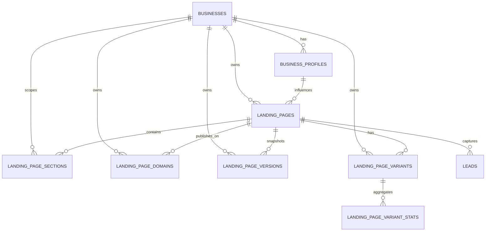

# Digital Growth OS — Architektura systemu Landing Pages
> Data: 2026-03-31
> Wersja: 1.0
> Bazuje na: `docs/project-analysis.md`, `docs/architecture-plan.md`, `docs/landing-pages-analysis.md`

## 1. Cel architektury

System Landing Pages ma stac sie tenantowym modulem SaaS odpowiedzialnym za:

- tworzenie draftow landing pages,
- generowanie tresci na bazie `BusinessProfile`,
- edycje strony jako zestawu sekcji,
- publikacje strony pod publicznym adresem,
- obsluge lead capture,
- SEO i analityke konwersji,
- przyszla obsluge eksperymentow A/B.

Modul ma pozostac zgodny ze stosem Laravel 13 + Inertia + React i wykorzystac istniejace elementy repozytorium: `LandingPage`, `LandingPageSection`, `BusinessProfile`, `LeadService`, `PublicLandingPageController`.

---

## 2. Granice kontekstu LandingPages

### Odpowiedzialnosc kontekstu

Kontekst `LandingPages` zarzadza:

- definicja strony,
- struktura sekcji i ich kolejnoscia,
- publikacja i statusy,
- routing publiczny,
- meta dane SEO,
- domeny i warianty publikacji,
- integracja z `BusinessProfile` jako źrodlem kontekstu tresci.

### Co nie nalezy do tego kontekstu

- zapis leada do CRM,
- scoring leada,
- kampanie marketingowe,
- globalne tresci strony glownej (`SiteSection`),
- CMS legal pages (`Page`),
- subskrypcje SaaS.

### Interfejsy do innych kontekstow

- `BusinessProfile` -> dostarcza AI/context brandowy.
- `Leads` -> przyjmuje submit formularza z landing page.
- `Automations` -> nasluchuje zdarzen publikacji i przechwycenia leada.
- `Subscriptions` -> w przyszlosci ogranicza limity planu (liczba stron, domen, wariantow).

---

## 3. Strategia modelu danych

## 3.1 Decyzja: struktura sekcji jako relacje + tresc sekcji w JSON

### Rekomendacja

Najlepszy model dla Landing Pages w tym projekcie to:

- `landing_pages` jako agregat strony,
- `landing_page_sections` jako relacyjne bloki,
- `content` i `settings` sekcji przechowywane w JSON,
- dodatkowe encje dla publikacji, domen i wariantow.

To jest kompromis miedzy sztywnym modelem relacyjnym a czystym JSON-em calej strony.

### Dlaczego nie trzymac calej strony jako jeden JSON

Model `page_json` w jednej kolumnie dalby szybki start, ale pogorszylby:

- walidacje pojedynczych sekcji,
- reorder i edycje blokow,
- A/B testing na poziomie wariantu,
- indeksowanie i raportowanie,
- mozliwosc dalszego rozszerzania buildera.

### Dlaczego nie rozbijac kazdej sekcji na osobne tabele

Pelna normalizacja typu `landing_page_hero_sections`, `landing_page_cta_sections`, `landing_page_faq_items` bylaby zbyt kosztowna i sztywna na etapie MVP. Generator LP potrzebuje elastycznego payloadu, a nie wielu specjalizowanych modeli.

### Finalna decyzja

**Agregat strony w tabeli `landing_pages`, struktura w `landing_page_sections`, tresc sekcji jako JSON.**

---

## 3.2 Docelowe tabele

### `landing_pages`

Glowna encja strony.

```
landing_pages
- id
- business_id
- business_profile_snapshot_id nullable
- current_version_id nullable
- title
- slug
- language
- template_key
- status                 (draft|published|archived)
- meta_title
- meta_description
- og_image_path nullable
- canonical_url nullable
- conversion_goal nullable
- default_assignee_id nullable
- thank_you_url nullable
- capture_fields nullable JSON
- ai_generated boolean
- ai_generation_source nullable    (manual|business_profile|prompt|clone)
- published_at nullable
- archived_at nullable
- views_count unsigned int
- conversions_count unsigned int
- cache_version unsigned int default 1
- created_at / updated_at / deleted_at
```

Indeksy:

- `(business_id, status)`
- `(business_id, slug)` unique dla draft/admin
- `(status, published_at)`
- `(business_id, language)`

Uwagi:

- `business_profile_snapshot_id` zabezpiecza generator przed dryfem danych brandowych po czasie.
- `cache_version` sluzy do taniego bustingu cache po publikacji lub update.

### `landing_page_sections`

Bloki tresci w ukladzie strony.

```
landing_page_sections
- id
- business_id
- landing_page_id
- version_id nullable
- type
- order
- content JSON
- settings JSON
- is_visible boolean
- created_at / updated_at
```

Indeksy:

- `(landing_page_id, order)`
- `(business_id, landing_page_id)`
- `(landing_page_id, type)`

Uwagi:

- `business_id` ma byc powielony mimo relacji do strony, zeby uproscic scope tenantowy i analityke.
- `version_id` pozwala powiazac sekcje z wersja strony, jesli wersjonowanie zostanie wlaczone.

### `landing_page_versions` opcjonalnie od MVP+1

Przechowuje snapshoty strony.

```
landing_page_versions
- id
- business_id
- landing_page_id
- version_number
- source                 (manual_save|publish|ai_regenerate|rollback)
- title_snapshot
- meta_snapshot JSON
- page_snapshot JSON
- created_by nullable
- created_at
```

Uwagi:

- `page_snapshot` zawiera caly snapshot sekcji i metadanych.
- To jest bezpieczniejsze niz wersjonowanie na zywo w podstawowych tabelach.

### `landing_page_domains`

Obsluga adresow publikacji.

```
landing_page_domains
- id
- business_id
- landing_page_id nullable
- host
- type                    (platform_subdomain|custom_domain)
- is_primary boolean
- ssl_status              (pending|issued|failed)
- dns_status              (pending|verified|failed)
- verified_at nullable
- created_at / updated_at
```

Indeksy:

- `host` unique
- `(business_id, type)`
- `(landing_page_id, is_primary)`

Uwagi:

- rekord moze wskazywac konkretna stronę lub w przyszlosci caly tenant website root.

### `landing_page_variants` future-ready

Warianty do A/B testingu.

```
landing_page_variants
- id
- business_id
- landing_page_id
- key                    (a|b|hero-1|offer-2)
- name
- status                 (draft|active|paused|archived)
- allocation_percent
- is_control boolean
- version_id nullable
- created_at / updated_at
```

### `landing_page_variant_stats` future-ready

```
landing_page_variant_stats
- id
- business_id
- landing_page_variant_id
- date
- impressions_count
- conversions_count
- bounce_count nullable
- created_at / updated_at
```

---

## 4. Powiazanie z Business Profile

## 4.1 Decyzja

`BusinessProfile` jest upstreamem dla `LandingPages` i ma dostarczac dane do:

- generowania tresci AI,
- doboru tone of voice,
- ustawien brandingu,
- meta danych,
- domyslnych CTA i danych kontaktowych.

### Dane wykorzystywane z `business_profiles`

- `tagline`
- `description`
- `industry`
- `tone_of_voice`
- `target_audience`
- `services`
- `brand_colors`
- `fonts`
- `website_url`
- `social_links`
- `seo_keywords`

### Dane wykorzystywane z `businesses`

- `name`
- `slug`
- `locale`
- `logo_path`
- `primary_color`
- `settings`

## 4.2 Model integracji

Runtimowo strona nie powinna czytac wszystkiego z `BusinessProfile` przy kazdym requestcie publicznym. Zamiast tego architektura powinna byc dwuwarstwowa:

1. `BusinessProfile` jako źrodlo wejściowe do generacji i defaultow.
2. `LandingPage` jako snapshot wyniku publikowanego publicznie.

To pozwala zachowac stabilnosc opublikowanej strony nawet wtedy, gdy tenant zmieni brand colors, tagline lub listę uslug.

## 4.3 Snapshot kontekstu

Przy generacji lub publikacji strona powinna tworzyc snapshot contextu biznesowego, np. przez `business_profile_snapshot_id` lub zapis do `landing_page_versions.page_snapshot`.

Wniosek: `BusinessProfile` nie jest runtime dependency dla renderowania publicznej strony. Jest dependency generacyjne i administracyjne.

---

## 5. Powiazanie z tenantem

## 5.1 Decyzja: Single DB + `business_id`

Modul Landing Pages ma byc w pelni tenantowy przez `business_id` na wszystkich tabelach modułu:

- `landing_pages`
- `landing_page_sections`
- `landing_page_versions`
- `landing_page_domains`
- `landing_page_variants`
- `landing_page_variant_stats`

## 5.2 Izolacja prywatna

W panelu admin tenant ma byc ustalany przez `currentBusiness()` i wymuszany przez:

- `BelongsToTenant`
- `BusinessScope`
- `LandingPagePolicy`
- middleware `has.business`

## 5.3 Izolacja publiczna

Publiczny runtime nie moze polegac wyłącznie na `slug`.

Docelowo tenant na publicznym wejściu musi byc rozpoznawany przez jedno z dwoch zrodel:

1. `host` / subdomena platformowa,
2. `host` / custom domain.

Slug ma byc identyfikatorem strony dopiero wewnatrz tenant contextu.

### Niedozwolony model docelowy

`/lp/{slug}` bez tenant contextu jako jedyne zrodlo identyfikacji nie skaluje sie wielodzierzawczo i prowadzi do kolizji slugow.

---

## 6. Publikacja stron

## 6.1 Dwa tryby publikacji

System powinien wspierac dwa tryby publikacji:

### A. Platform subdomain

Przyklad:

- `tenant.app.com`
- `tenant.app.com/lp/free-seo-audit`

To powinien byc domyslny model MVP.

### B. Platform subdomain + clean public page

Przyklad:

- `tenant.app.com/free-seo-audit`

Mozliwy jako uproszczona warstwa marketingowa, ale wymaga rezerwacji slugow systemowych.

### C. Custom domain

Przyklad:

- `audit.firma.pl`
- `offer.clientdomain.com`

To powinno wejsc po MVP jako funkcja planow wyzszych.

## 6.2 Rekomendacja publikacji dla MVP

**MVP: `https://{business.slug}.app.com/lp/{slug}`**

Uzasadnienie:

- eliminuje kolizje slugow miedzy tenantami,
- upraszcza routing,
- pozwala zachowac obecna semantyke `/lp/{slug}` jako segment strony,
- nie wymaga od razu custom domains i zlozonej weryfikacji DNS.

## 6.3 Statusy publikacji

Rekomendowane statusy:

- `draft`
- `published`
- `archived`

Opcjonalnie pozniej:

- `scheduled`
- `unpublished`

## 6.4 Proces publikacji

1. Walidacja strony: co najmniej jedna sekcja, co najmniej jedna sekcja `form` jesli celem jest lead capture.
2. Walidacja slug i hosta w kontekscie tenantowym.
3. Inkrement `cache_version`.
4. Opcjonalny zapis snapshotu wersji.
5. Emisja eventu `LandingPagePublished`.

---

## 7. Routing publiczny

## 7.1 Routing admin/private

Panel prywatny pozostaje pod:

- `/landing-pages`
- `/landing-pages/{landingPage}`
- `/landing-pages/{landingPage}/edit`

To jest routing administracyjny tenant-aware przez sesje i middleware.

## 7.2 Routing publiczny MVP

Rekomendowany publiczny routing:

- `GET /lp/{slug}` uruchamiany po rozpoznaniu business z hosta,
- `POST /lp/{slug}/submit` rowniez po rozpoznaniu business z hosta.

Logika rozpoznania:

1. Middleware `ResolvePublicTenant` identyfikuje tenant z hosta.
2. Kontroler wyszukuje stronę po `(business_id, slug, status=published)`.

### Przyklad

Host: `acme.app.com`

Route:

- `GET /lp/free-audit`
- `POST /lp/free-audit/submit`

Lookup:

- `LandingPage::where('business_id', $resolvedBusiness->id)->where('slug', 'free-audit')->published()`

## 7.3 Routing custom domains

Przyszly routing:

- `GET /` dla strony przypietej bezpośrednio do hosta,
- `GET /{slug}` dla multi-page hosta tenantowego,
- `GET /lp/{slug}` jako fallback kompatybilnosciowy.

Wymaga tabeli `landing_page_domains` i middleware mapujacego `host` -> `business` -> `landing_page`.

## 7.4 Fallback i kompatybilnosc wsteczna

Na okres przejsciowy mozna utrzymac stara trasę `/lp/{slug}` w glownej domenie aplikacji, ale tylko jako tryb compatibility i tylko dopoki slug jest globalnie wymuszony albo request zawiera tenant context.

---

## 8. SEO

## 8.1 Pola SEO na poziomie strony

Podstawowe pola SEO musza byc przechowywane w `landing_pages`:

- `slug`
- `title`
- `meta_title`
- `meta_description`
- `og_image_path`
- `canonical_url`
- `language`

## 8.2 Zasady generowania SEO

### `title`

Pole robocze dla edytora i nawigacji admin.

### `meta_title`

Renderowany do `<title>` i `og:title`. Jesli null, fallback do `title`.

### `meta_description`

Renderowana do `meta description` i `og:description`. Powinna byc snapshotem, a nie wartoscia liczona dynamicznie per request.

### `slug`

Unikalny w tenant scope, ASCII/lowercase/hyphenated, z blacklistą systemową.

### `canonical_url`

Powinno byc liczone podczas publikacji na podstawie domeny glownej i sluga, a nie skladane kazdorazowo z requestu.

## 8.3 SEO a jezyk

W MVP rekomendowany jest model:

- jedna landing page = jeden jezyk publikacji.

Powod:

- obecne sekcje nie sa translatable,
- edytor i payload JSON nie obsluguja multi-locale content,
- to upraszcza generator, routing i SEO.

Rozszerzenie pozniejsze:

- `landing_page_localizations` albo translatable JSON per sekcja.

## 8.4 Structured Data

Future-ready:

- `FAQPage` schema dla sekcji `faq`,
- `Organization` schema z `BusinessProfile`,
- `Product` / `Service` schema dla wybranych templatek.

---

## 9. Wydajnosc i caching

## 9.1 Cele wydajnosciowe

Publiczna landing page musi byc tania w odczycie i bezpieczna dla skokow ruchu kampanijnego.

### Realia ruchu

LP sa bardziej burst-oriented niz typowy CRM. Najwieksze obciazenie pojawia sie przy kampaniach Meta/Google Ads lub po wysylce email/SMS.

## 9.2 Rekomendacja cache

### Cache poziomu strony publicznej

Cache kluczem:

`lp:{host}:{slug}:v{cache_version}`

Payload cache:

- zdenormalizowana strona gotowa do renderowania,
- metadane SEO,
- posortowane sekcje,
- lekkie dane host/domain resolution.

TTL:

- 5 do 30 minut dla strony,
- natychmiastowy bust przy publish/update/unpublish.

### Cache host resolution

Cache kluczem:

`lp_host:{host}`

Zawiera:

- `business_id`
- `domain_id`
- `landing_page_id` jesli host jest page-bound

TTL:

- 30 do 60 minut.

## 9.3 Cache a submit formularza

Submit formularza nie powinien byc cacheowany. Powinien uzywac:

- throttling,
- honeypot,
- deduplikacji,
- lekkiej walidacji requestu,
- kolejki dla downstream side effects.

## 9.4 Renderowanie

Render moze pozostac po stronie Inertia + React, ale dane strony powinny byc przygotowane w backendzie w jednym odczycie:

- `landing_page`
- `sections`
- ewentualne dane formularza

Brak lazy loading i brak dodatkowych runtime query dla pojedynczej strony publicznej.

## 9.5 Liczniki i analityka

`views_count` i `conversions_count` nie powinny byc krytycznymi write paths przy duzym ruchu.

Rekomendacja:

- MVP: atomic increments w DB,
- pozniej: write-behind przez queue / buffered analytics table.

---

## 10. Wersjonowanie stron

## 10.1 Decyzja

Wersjonowanie jest opcjonalne, ale architektura powinna byc gotowa od poczatku.

## 10.2 Model rekomendowany

Wersjonowanie przez snapshoty, nie przez soft changes in-place.

### Dlaczego snapshoty

- proste rollbacki,
- bezpieczne porownanie zmian,
- zgodnosc z AI regenerate,
- brak komplikowania glownej tabeli `landing_page_sections`.

## 10.3 Kiedy tworzyc wersje

- publish,
- manual save z opcja `Save as version`,
- AI regenerate,
- restore/rollback.

## 10.4 Co przechowywac w wersji

- metadane SEO,
- ustawienia strony,
- kompletny zestaw sekcji,
- informacje o zrodle zmiany.

MVP moze wystartowac bez UI do wersji, ale z tabela gotowa na rozszerzenie.

---

## 11. A/B testing jako future

## 11.1 Zakres future

A/B testing nie powinien wchodzic do MVP, ale model ma byc kompatybilny z przyszlym rozwojem.

## 11.2 Minimalna architektura future

- `landing_page_variants`
- `landing_page_variant_stats`
- `variant_key` w cookie lub session
- routing przypisujacy usera do wariantu przy pierwszym wejściu

## 11.3 Zasady

- jeden wariant kontrolny,
- procentowy split ruchu,
- formularz submit przypisany do konkretnego wariantu,
- raportowanie per variant.

## 11.4 Integracja z leadami

`LeadSource` powinno docelowo przechowywac:

- `landing_page_id`
- `landing_page_variant_id`
- UTM
- host/domain

To pozwoli liczyc conversion rate per variant.

---

## 12. Diagram relacji



---

## 13. ADR-lite

### ADR-LP-001: Model strony jako agregat + sekcje JSON

**Status**: Zaproponowana

**Kontekst**: System potrzebuje elastycznego buildera sekcji oraz kompatybilnosci z AI generation.

**Decyzja**: Uzywamy `landing_pages` + `landing_page_sections`, gdzie sekcje przechowuja `content` i `settings` jako JSON.

**Konsekwencje**:

- Zalety: elastycznosc, prostsza generacja, latwy reorder i rozbudowa o nowe typy sekcji.
- Wady: mniej sztywna walidacja struktury, czesc kontraktu sekcji musi pozostac w kodzie aplikacji.

### ADR-LP-002: `BusinessProfile` jako upstream, nie runtime dependency

**Status**: Zaproponowana

**Kontekst**: LP ma korzystac z danych brandowych, ale opublikowana strona musi byc stabilna po czasie.

**Decyzja**: `BusinessProfile` sluzy do generacji i defaultow, a publiczna strona renderuje snapshot zapisany w `LandingPage` / `LandingPageVersion`.

**Konsekwencje**:

- Zalety: stabilnosc publikacji, przewidywalny SEO output, mniej runtime query.
- Wady: potrzeba mechanizmu snapshotu i ewentualnej synchronizacji przy regeneracji.

### ADR-LP-003: Publiczny tenant resolution przez host

**Status**: Zaproponowana

**Kontekst**: Obecny routing `/lp/{slug}` nie rozwiazuje kolizji slugow miedzy tenantami.

**Decyzja**: Tenant publiczny jest identyfikowany przez host/subdomain/custom domain, a slug jest rozpatrywany dopiero w jego scope.

**Konsekwencje**:

- Zalety: poprawna tenantowosc, skalowalnosc, gotowosc pod custom domains.
- Wady: potrzeba middleware host resolution i tabeli mapowania domen.

### ADR-LP-004: MVP publish path jako `{tenant}.app.com/lp/{slug}`

**Status**: Zaproponowana

**Kontekst**: Potrzebny jest prosty i bezpieczny model publikacji dla pierwszej wersji.

**Decyzja**: W MVP publikujemy strony pod tenantowa subdomena platformowa oraz segmentem `/lp/{slug}`.

**Konsekwencje**:

- Zalety: niski koszt implementacji, brak kolizji, spojnosc z obecnym routingiem.
- Wady: URL mniej marketingowy niz custom domain lub page-root path.

### ADR-LP-005: Wersjonowanie przez snapshoty

**Status**: Zaproponowana

**Kontekst**: AI regeneration i rollback wymagaja bezpiecznej historii strony.

**Decyzja**: Wersjonowanie oparte o `landing_page_versions` i snapshot calej strony.

**Konsekwencje**:

- Zalety: proste rollbacki, latwe porownanie, brak komplikacji modelu live.
- Wady: wieksze payloady i dodatkowa tabela.

---

## 14. Nastepne kroki architektoniczne

1. Ujednolicic runtime model publikacji wokol host-based tenant resolution.
2. Doprowadzic model `LandingPage` do zgodnosci miedzy schema i serwisami.
3. Wprowadzic snapshot `BusinessProfile` -> `LandingPage` przy generacji/publikacji.
4. Zdefiniowac kontrakt JSON dla wszystkich typow sekcji i generatora AI.
5. Przygotowac `landing_page_domains` jako podstawe pod subdomeny i custom domains.
6. Dodac wersjonowanie snapshotowe przed wdrozeniem AI regenerate.

---

## 15. Podsumowanie decyzji

- **Model danych**: strona jako agregat `landing_pages`, sekcje jako relacje w `landing_page_sections`, tresc sekcji w JSON.
- **Business Profile**: upstream dla generatora i SEO defaults, ale nie runtime dependency strony publicznej.
- **Tenant**: wszedzie `business_id`, publicznie tenant rozpoznawany po hoście, nie po samym slug.
- **Publikacja MVP**: `https://{tenant}.app.com/lp/{slug}`.
- **SEO**: jedna strona = jeden jezyk publikacji, snapshot metadanych przy publikacji.
- **Caching**: cache strony po `host + slug + cache_version`, bustowany przy update/publish.
- **Wersjonowanie**: opcjonalne, ale rekomendowane przez snapshoty.
- **A/B testing**: poza MVP, ale model danych ma byc od poczatku kompatybilny z wariantami.